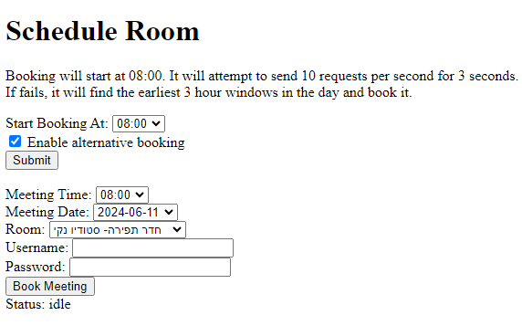

# Visual Arts Room Scheduler
Tired of waking up early and still losing the race to book a room?\
This project ensures you'll never miss out on securing a spot, no matter how competitive it gets.\
Works for [Visual Theatre](https://students.visualtheatre.co.il/) only.



# Overview
This project allows you to preconfigure your room booking specifications, handling everything automatically to ensure you're first in line when the booking window opens.\
It also includes failure handling: If your initial booking attempt fails, the system is able to find the next best slot and book it.

It is basically a simple FastApi front that interact with a python backend.\
The backend is a python script that uses threading to handle the time-sensitive booking operations, including authentication and form token handling.\
It sends multiple (10 per second) concurrent requests in an attempt to win the race. if it loses - it queries the other available time slots and book the most fitting one.\
Most of the complexity in writing this was the API research.


## Features
* Preconfiguration of Booking Details
* Automated Booking System
* Concurrent request to optimize odds
* Failure handling with alternative time deduction
* Real-time Status Updates

## Tech Stack
* Frontend: FastAPI for the web framework, JavaScript for client-side logic, HTML for presentation.
* Backend: Python, with threading, handling booking operations, including authentication and form token handling.


## Getting Started

* Clone this repository.
```bash
pip intall -r requirements.txt
python main.py
```
* Go to `http://127.0.0.1:8000`

## Why This Project?
I Wrote this project to help a friend who was tired of waking up early and still losing the race.
Now he can sleep in.

Feel free to contribute to the project or fork it to adapt to other booking needs. Never lose the race again!

